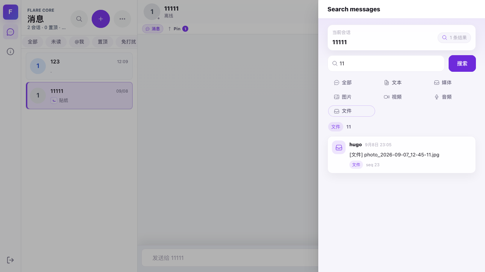

# 消息搜索筛选修复与发布记录

## 修复

- Rust 绑定的 `message.search`、`message.search_in_conversation`、`message.search_by_query`
  均完整解析 `MessageSearchQuery`，使用同一基础 SDK 查询入口。Android JNI、Apple/C FFI、Flutter
  与 WASM 共享这项修复，不需要各端各写一份筛选。
- 内存消息仓储实现完整条件过滤，IndexedDB 包装转发完整查询；全局内存搜索不再忽略关键词。
- SQLite 与内存复用消息类型映射及 typed 内容搜索文本提取。先过滤，再排序、限制数量。
- 未实现完整查询的第三方仓储明确返回 `OperationNotSupported`，避免静默丢失条件。
- 原有连接恢复修复保留。
- Web 结果标签将文本/富文本/引用归为“文本”，图片/图组归为“图片”。

## 验证

- 核心 SDK 全量单元测试：466 项通过。
- 共享绑定：49 项通过，包含三个入口的组合条件回归。
- SQLite/搜索专项：8 项通过。
- C FFI：11 项通过。
- 跨平台 wire 编码一致性检查：4 个平台、12 处通过。
- `cargo xtask core-codegen-check` 通过；生成代码来自 Rust 合约源。
- WASM release 构建、Web TypeScript 检查及生产包构建通过。
- 本地 Chromium 和线上实际 WASM 均通过 21 组“入口 × 类型”以及 5 组组合条件测试。
  测试快照只存在于隔离浏览器的存储 host 中，不向服务器发送测试消息。
- 真实线上 UI：hugo 登录后打开 11111 会话，关键词 `11`，全部结果 5 条；切换“文件”后仅
  剩 1 条文件消息，seq 23，文本和 @ 消息未混入。没有发送、编辑或删除聊天消息。
- 标签修正上线后再次验证真实 UI：“文本”3 条且标签全部为文本；“文件”1 条且标签为文件。
  可使用 `scripts/check-web-search-ui.mjs` 复测。

## Web 发布

- 地址：https://118-107-9-221.sslip.io
- 发布目录：`/var/www/flare-web`
- 旧版备份：`/var/www/flare-web.backup-20260909-search-2f010e76`
- 标签修正发布的上一版本：`/var/www/flare-web.backup-20260909-search-labels`
- 278 个发布文件校验通过后原子交换目录，保留旧哈希资源，并重新生成 gzip。
- 公网首页、WASM JS、WASM 二进制返回 200，解压后的内容与本地构建完全一致。
- WASM SHA256 前缀：`2f010e769fc83416`。

## 原生端产物

- Android：arm64-v8a、armeabi-v7a、x86_64 release 库构建成功，SDK 包、Android 示例、Flutter 示例三份副本 SHA256 均与 core dist 一致。
- iOS：aarch64-apple-ios 真机、aarch64-apple-ios-sim 和 x86_64-apple-ios 模拟器 release 库构建成功，iOS 示例副本 SHA256 一致。
- Flutter iOS 模拟器静态库已合并为 arm64 + x86_64。真机构建由现有 Xcode 脚本按目标平台选择静态库。
- macOS 宿主 arm64 + x86_64 通用库构建成功，产物放置校验通过；最终执行 make sync 同步全部原生库。iOS 示例宿主 dylib 和 Flutter macOS dylib 的 SHA256 与 core dist 一致；lipo 确认 macOS 和 Flutter iOS 模拟器均含两个架构。
- 没有连接 Android 设备或启动 iOS 模拟器；以上交叉编译和共享逻辑测试不等同于移动端真机运行验证。

